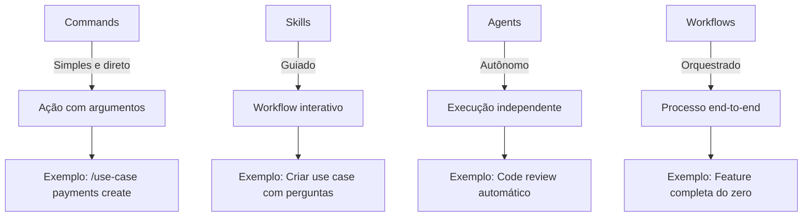

# Claude Code Configuration

Esta pasta contém todas as configurações para o Claude Code trabalhar de forma otimizada neste projeto, seguindo a estrutura oficial do **Claude Agent SDK**.

## 📁 Estrutura

```
.claude/
├── README.md                    # Este arquivo - overview
├── settings.local.json          # Configurações locais do projeto
├── hooks.json                   # Hooks automáticos (11 configurados)
├── patterns.md                  # Templates de código (20+ templates)
│
├── commands/                    # Comandos diretos com argumentos
│   ├── use-case.md             # Criar use case backend
│   ├── feature.md              # Criar feature frontend
│   ├── pre-commit.md           # Validações pré-commit
│   ├── db-migrate.md           # Helper de migrations
│   └── arch-validate.md        # Validar arquitetura
│
├── skills/                      # Prompt templates for guided workflows
│   └── README.md               # Skills documentation
│
├── agents/                      # Autonomous AI workers
│   └── README.md               # Agents documentation
│
└── workflows/                   # End-to-end orchestrated processes
    └── README.md               # Workflows documentation
```

## 🎯 Quick Start

### Comandos Mais Usados

```bash
# Criar novo use case no backend
/use-case <feature> <nome-do-use-case>

# Criar novo módulo no frontend
/feature <nome-da-feature>

# Validar antes de commitar
/pre-commit

# Criar migração do banco
/db-migrate <nome-da-migracao>

# Validar arquitetura
/arch-validate
```

### Ver Todos os Comandos

```bash
/help
```

---

## 📚 Hierarquia de Recursos

O Claude Code oferece diferentes níveis de automação:



### 1. Commands (Comandos)
**Quando usar:** Ações diretas e rápidas

- ✅ Você sabe exatamente o que quer
- ✅ Poucos parâmetros necessários
- ✅ Execução imediata

**Exemplo:** `/use-case payments create-payment`

📖 [Documentação de Commands](commands/)

---

### 2. Skills (Habilidades)
**Quando usar:** Workflows guiados e interativos

- 🤔 Você precisa de orientação
- ❓ Múltiplas decisões a tomar
- 🎯 Processo passo a passo

**Exemplo:** `/skill create-use-case` (vai perguntar detalhes)

📖 [Documentação de Skills](skills/README.md)

---

### 3. Agents (Agentes)
**Quando usar:** Tarefas complexas e autônomas

- 🤖 Você quer delegar totalmente
- ⏱️ Tarefa demorada (minutos)
- 🧠 Requer decisões inteligentes

**Exemplo:** Agent de code review analisa tudo automaticamente

📖 [Documentação de Agents](agents/README.md)

---

### 4. Workflows (Fluxos)
**Quando usar:** Processos end-to-end completos

- 🔄 Múltiplas etapas sequenciais
- 🎭 Orquestra commands + skills + agents
- 🎯 Objetivo final bem definido

**Exemplo:** `/workflow full-feature` (cria feature completa)

📖 [Documentação de Workflows](workflows/README.md)

---

## ⚙️ Configuração

### settings.local.json

Arquivo central de configuração do projeto. Controla:

- ✅ Quais comandos/skills/agents/workflows estão habilitados
- ✅ Configurações de cada recurso
- ✅ Integrações (MCP servers)
- ✅ Validações automáticas
- ✅ Preferências de code generation

**Edite:** [settings.local.json](settings.local.json)

---

### hooks.json

Hooks automáticos que executam em eventos:

- **UserPromptSubmit:** Antes de processar seu prompt
- **PreToolUse:** Antes de executar ferramentas
- **PostToolUse:** Depois de executar ferramentas

**Edite:** [hooks.json](hooks.json)

---

### patterns.md

Templates de código reutilizáveis:

- 🏗️ 13 templates de backend (Clean Architecture)
- 🎨 5 templates de frontend (Feature-Sliced Design)
- 🧪 2 templates de testes

**Veja:** [patterns.md](patterns.md)

---

## 🚀 Como Começar

### Passo 1: Entenda a Estrutura

Leia este README completamente (5 minutos).

### Passo 2: Teste um Comando

Experimente criar algo simples:

```bash
/use-case test create-test
```

### Passo 3: Explore Skills

Skills estão documentados em [skills/README.md](skills/README.md).

### Passo 4: Leia a Documentação Completa

- 📖 [Guia de Uso Completo](USAGE-GUIDE.md)
- 🎬 [Exemplo de Workflow](EXAMPLE-WORKFLOW.md)
- ✅ [Checklist de Instalação](INSTALLATION-CHECKLIST.md)

### Passo 5: Customize

Ajuste `settings.local.json` para suas preferências.

---

## 📊 Recursos Disponíveis

| Tipo | Quantidade | Status |
|------|-----------|--------|
| **Commands** | 5 | ✅ Funcional |
| **Skills** | 5 | 🚧 Planejado |
| **Agents** | 5 | 🚧 Planejado |
| **Workflows** | 5 | 🚧 Planejado |
| **Hooks** | 11 | ✅ Funcional |
| **Templates** | 20+ | ✅ Funcional |

---

## 🎓 Documentação Adicional

### Para Iniciantes
1. 👉 [Este README](README.md) - Você está aqui!
2. 📖 [USAGE-GUIDE.md](USAGE-GUIDE.md) - Guia completo de uso
3. 🎬 [EXAMPLE-WORKFLOW.md](EXAMPLE-WORKFLOW.md) - Exemplo prático

### Para Usuários Avançados
1. ⚙️ [settings.local.json](settings.local.json) - Configuração avançada
2. 🪝 [hooks.json](hooks.json) - Hooks customizados
3. 🎨 [patterns.md](patterns.md) - Templates de código

### Referência Completa
1. 📋 [INDEX.md](INDEX.md) - Índice de toda documentação
2. ✅ [INSTALLATION-CHECKLIST.md](INSTALLATION-CHECKLIST.md) - Validação
3. 📊 [SETUP-SUMMARY.md](SETUP-SUMMARY.md) - Resumo do setup

---

## 🔌 Integrações (MCP Servers)

MCP (Model Context Protocol) servers estendem funcionalidades:

### GitHub MCP
- Criar/listar PRs
- Gerenciar issues
- Comentar em PRs

### Filesystem MCP
- Operações avançadas de arquivo
- Busca em múltiplos diretórios
- Análise de codebase

**Configuração:** Veja [../.mcp.json](../.mcp.json)

---

## 🛠️ Customização

### Adicionar Novo Comando

1. Crie `commands/meu-comando.md`
2. Documente em `USAGE-GUIDE.md`
3. Teste e compartilhe

### Adicionar Novo Skill

1. Crie `skills/meu-skill.md`
2. Documente em `skills/README.md`
3. Configure em `settings.local.json`

### Adicionar Novo Agent

1. Crie `agents/meu-agent.md`
2. Documente em `agents/README.md`
3. Configure em `settings.local.json`

### Adicionar Novo Workflow

1. Crie `workflows/meu-workflow.md`
2. Documente em `workflows/README.md`
3. Configure em `settings.local.json`

---

## 📈 Benefícios

### Produtividade
- ⚡ **85% mais rápido** na criação de features
- ⚡ **Zero tempo** decidindo estrutura de pastas
- ⚡ **Automação** de tarefas repetitivas

### Qualidade
- 🎯 **100% consistência** nos padrões arquiteturais
- 🎯 **Menos bugs** por validações automáticas
- 🎯 **Código limpo** por templates bem definidos

### Onboarding
- 📚 **Novos devs** aprendem padrões instantaneamente
- 📚 **Documentação** sempre atualizada
- 📚 **Exemplos** práticos e funcionais

---

## 🐛 Troubleshooting

### Comandos não aparecem
1. Verifique sintaxe YAML do frontmatter
2. Reinicie Claude Code
3. Rode `/help` para listar

### Hooks não funcionam
1. Valide JSON em `hooks.json`
2. Verifique regex dos matchers
3. Veja logs do Claude Code

### Skills/Agents/Workflows não funcionam
1. Verifique `settings.local.json`
2. Confirme que `enabled: true`
3. Veja documentação específica

**Guia Completo:** [USAGE-GUIDE.md - Troubleshooting](USAGE-GUIDE.md#troubleshooting)

---

## 🔗 Links Úteis

### Documentação Oficial
- [Claude Code Docs](https://code.claude.com/docs)
- [Slash Commands](https://code.claude.com/docs/en/slash-commands.md)
- [Hooks Reference](https://code.claude.com/docs/en/hooks.md)
- [MCP Servers](https://code.claude.com/docs/en/mcp.md)
- [Claude Agent SDK](https://github.com/anthropics/claude-agent-sdk)

### Repositórios
- [Claude Code GitHub](https://github.com/anthropics/claude-code)
- [MCP Servers](https://github.com/modelcontextprotocol)

---

## 🤝 Contribuindo

Melhorias são bem-vindas!

1. **Fork** o projeto
2. **Crie** sua feature/fix
3. **Teste** completamente
4. **Documente** suas mudanças
5. **Abra** um Pull Request

---

## 📝 Changelog

### v1.0.0 (2025-11-20)
- ✅ Estrutura oficial do Claude Agent SDK
- ✅ 5 comandos funcionais
- ✅ 11 hooks configurados
- ✅ 20+ templates de código
- ✅ Skills/Agents/Workflows planejados
- ✅ Documentação completa (8 arquivos)
- ✅ settings.local.json configurado

---

## 📞 Suporte

### Issues do Projeto
Abra issue no repositório do projeto

### Issues do Claude Code
[GitHub Issues](https://github.com/anthropics/claude-code/issues)

---

**Happy Coding! 🚀**

> Esta configuração segue a estrutura oficial do Claude Agent SDK e pode ser compartilhada com todo o time.

---

**Versão:** 1.0.0
**Última Atualização:** 2025-11-20
**Projeto:** Controle Econômico (NestJS + Next.js)
