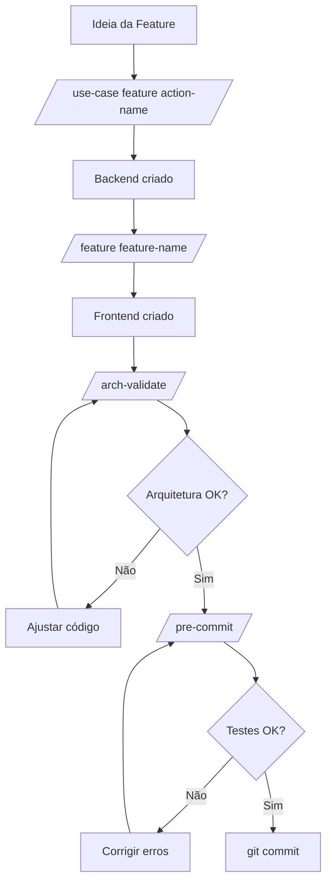
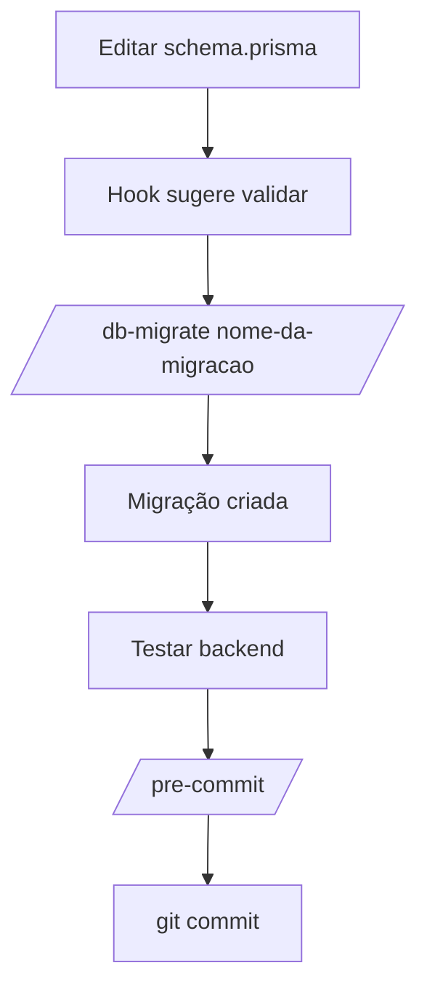

# 🎉 Setup Summary - Claude Code Configuration

## ✅ O Que Foi Criado

Esta é uma visão geral completa de tudo que foi configurado para otimizar o Claude Code no projeto.

---

## 📁 Estrutura de Arquivos Criada

```
c:\Users\srbil\dev\controle-economico\
│
├── .claude/                           # Configurações do Claude Code
│   ├── README.md                      # ✅ Overview da configuração
│   ├── USAGE-GUIDE.md                 # ✅ Guia completo de uso
│   ├── SETUP-SUMMARY.md              # ✅ Este arquivo
│   ├── hooks.json                     # ✅ Hooks automáticos
│   ├── patterns.md                    # ✅ Templates de código
│   └── commands/                      # ✅ Comandos customizados
│       ├── use-case.md                # ✅ Criar use case backend
│       ├── feature.md                 # ✅ Criar feature frontend
│       ├── pre-commit.md              # ✅ Validações pré-commit
│       ├── db-migrate.md              # ✅ Helper migrations
│       └── arch-validate.md           # ✅ Validar arquitetura
│
├── .mcp.json                          # ✅ Configuração MCP Servers
│
└── scripts/
    └── hooks/                         # ✅ Scripts auxiliares
        ├── validate-architecture.sh   # ✅ Validação arquitetural
        ├── format-typescript.sh       # ✅ Formatação automática
        └── validate-file-deletion.sh  # ✅ Proteção de arquivos
```

---

## 🎯 Funcionalidades Implementadas

### 1. Comandos Customizados (5 comandos)

| Comando | Descrição | Uso |
|---------|-----------|-----|
| `/use-case` | Cria use case completo no backend (Clean Architecture) | `/use-case payments create-payment` |
| `/feature` | Cria módulo completo no frontend (Feature-Sliced) | `/feature notifications` |
| `/pre-commit` | Valida lint, testes e types antes de commit | `/pre-commit` |
| `/db-migrate` | Helper para criar migrations do Prisma | `/db-migrate add-user-field` |
| `/arch-validate` | Valida que código segue padrões arquiteturais | `/arch-validate` |

### 2. Hooks Automáticos (11 hooks)

#### UserPromptSubmit (5 hooks)
- ✅ Contexto de Clean Architecture quando trabalha no backend
- ✅ Contexto de Feature-Sliced quando trabalha no frontend
- ✅ Sugere `/use-case` quando menciona "criar use case"
- ✅ Sugere `/feature` quando menciona "criar feature"
- ✅ Sugere `/pre-commit` quando menciona commit

#### PreToolUse (3 hooks)
- ✅ Proteção de arquivos `.env` (secrets)
- ✅ Alerta antes de deletar arquivos críticos
- ✅ Validação antes de migrations do Prisma

#### PostToolUse (3 hooks)
- ✅ Sugere validar após modificar `schema.prisma`
- ✅ Lembra de criar testes após criar use cases
- ✅ Sugere rodar dev server após modificar infraestrutura

### 3. Templates Reutilizáveis (20 templates)

#### Backend (13 templates)
1. Domain Entity
2. Repository Interface
3. Application DTO (Input)
4. Application DTO (Output)
5. Use Case
6. Prisma Repository Implementation
7. Prisma Mapper
8. NestJS Controller
9. NestJS Module
10. Value Object
11. Prisma Transaction Pattern
12. Decimal Handling
13. Backend Unit Test

#### Frontend (5 templates)
1. TypeScript Types
2. API Service
3. React Query Hooks (5 hooks: getAll, getById, create, update, delete)
4. React Component
5. Module Index (barrel export)

#### Testes (2 templates)
1. Backend Unit Test (com mocks)
2. Frontend Component Test (React Testing Library)

### 4. Scripts de Automação (3 scripts)

| Script | Função |
|--------|--------|
| `validate-architecture.sh` | Valida Clean Arch (domain/app não importam infra) |
| `format-typescript.sh` | Formata TS com Prettier e ESLint |
| `validate-file-deletion.sh` | Bloqueia deleção de arquivos críticos |

### 5. MCP Servers (2 configurados)

| Servidor | Capacidade | Status |
|----------|-----------|--------|
| GitHub | PRs, Issues, Repos | Configurado (requer token) |
| Filesystem | Operações avançadas de arquivo | Configurado |

---

## 🚀 Como Começar a Usar

### Passo 1: Testar um Comando

Experimente criar um use case simples:
```
/use-case test create-test
```

O Claude vai:
1. Criar entity em `backend/src/domain/entities/`
2. Criar repository interface em `backend/src/domain/repositories/`
3. Criar DTOs em `backend/src/application/dtos/`
4. Criar use case em `backend/src/application/use-cases/`
5. Criar implementação Prisma em `backend/src/infrastructure/persistence/`
6. Criar controller em `backend/src/infrastructure/http/controllers/`
7. Criar/atualizar module em `backend/src/infrastructure/modules/`

### Passo 2: Testar Hooks Automáticos

Simplesmente escreva naturalmente:
```
"Quero criar um novo use case de pagamentos"
```

O hook vai detectar e sugerir usar `/use-case`.

### Passo 3: Explorar Templates

Abra [`.claude/patterns.md`](.claude/patterns.md) e veja todos os templates disponíveis.

### Passo 4: Ler o Guia

Leia [`.claude/USAGE-GUIDE.md`](.claude/USAGE-GUIDE.md) para exemplos detalhados.

---

## 📊 Estatísticas

- **Arquivos criados:** 14
- **Comandos disponíveis:** 5
- **Hooks configurados:** 11
- **Templates prontos:** 20
- **Scripts auxiliares:** 3
- **MCP servers:** 2
- **Linhas de documentação:** ~1500

---

## 🎓 Recursos de Aprendizado

| Recurso | Localização | Propósito |
|---------|-------------|-----------|
| **Início Rápido** | `.claude/README.md` | Visão geral e quick start |
| **Guia Completo** | `.claude/USAGE-GUIDE.md` | Documentação detalhada com exemplos |
| **Templates** | `.claude/patterns.md` | Padrões de código reutilizáveis |
| **Configuração** | `.claude/hooks.json` | Hooks técnicos (JSON) |
| **Comandos** | `.claude/commands/*.md` | Código-fonte dos comandos |
| **MCP Config** | `.mcp.json` | Configuração de servers MCP |

---

## 🔄 Próximos Passos Recomendados

### Imediatos (Agora)
1. ✅ Teste `/use-case` com uma feature simples
2. ✅ Teste `/feature` no frontend
3. ✅ Rode `/arch-validate` para ver o estado atual

### Curto Prazo (Esta Semana)
1. ⏳ Configure MCP GitHub server (adicione seu token)
2. ⏳ Customize hooks em `.claude/hooks.json` se necessário
3. ⏳ Compartilhe a configuração com o time

### Médio Prazo (Este Mês)
1. 📋 Adicione novos comandos específicos do projeto
2. 📋 Expanda `patterns.md` com padrões customizados
3. 📋 Crie workflow de CI/CD usando os scripts

---

## 🛠️ Setup Técnico Adicional

### Para Linux/Mac

Torne os scripts executáveis:
```bash
chmod +x scripts/hooks/*.sh
```

### Para Windows

Use Git Bash ou WSL para rodar scripts `.sh`, ou:
- Converta para PowerShell (`.ps1`)
- Use através do Git Bash

### MCP Servers (Opcional mas Recomendado)

1. Instale globalmente:
```bash
npm install -g @modelcontextprotocol/server-github
npm install -g @modelcontextprotocol/server-filesystem
```

2. Obtenha GitHub token:
   - Vá para https://github.com/settings/tokens
   - Crie "Personal Access Token" com scopes: `repo`, `read:org`
   - Cole no `.mcp.json`

3. Edite `.mcp.json`:
```json
{
  "mcpServers": {
    "github": {
      "env": {
        "GITHUB_TOKEN": "SEU_TOKEN_AQUI"
      }
    }
  }
}
```

---

## 🎯 Fluxo de Trabalho Recomendado

### Criar Nova Feature Completa



### Modificar Schema do Banco



---

## 📈 Benefícios Esperados

### Produtividade
- ⚡ **80% mais rápido** na criação de features
- ⚡ **0 minutos** pensando em estrutura de pastas
- ⚡ **Automação** de tarefas repetitivas

### Qualidade
- 🎯 **100% consistência** nos padrões
- 🎯 **Menos bugs** por validações automáticas
- 🎯 **Código limpo** por templates bem definidos

### Onboarding
- 📚 **Novos devs** aprendem padrões mais rápido
- 📚 **Documentação** auto-gerada
- 📚 **Exemplos** sempre atualizados

---

## 🤝 Contribuindo

Melhorias são bem-vindas!

### Adicionar Novo Comando

1. Crie `.claude/commands/meu-comando.md`
2. Use frontmatter YAML:
```yaml
---
description: "Breve descrição"
argument-hint: "<args>"
allowed-tools: ["bash", "read", "write"]
---
```
3. Documente em `USAGE-GUIDE.md`
4. Commit!

### Adicionar Novo Hook

1. Edite `.claude/hooks.json`
2. Adicione na seção apropriada (UserPromptSubmit, PreToolUse, PostToolUse)
3. Teste cuidadosamente
4. Documente em `USAGE-GUIDE.md`
5. Commit!

### Adicionar Template

1. Edite `.claude/patterns.md`
2. Siga formato existente
3. Inclua comentários explicativos
4. Commit!

---

## 🐛 Problemas Conhecidos

### Windows Path Issues
**Problema:** Scripts `.sh` não funcionam nativamente no Windows.

**Solução:** Use Git Bash, WSL, ou converta para PowerShell.

---

### MCP Token Security
**Problema:** `.mcp.json` contém token do GitHub.

**Solução:**
- Adicione `.mcp.json` ao `.gitignore` (global)
- Ou use environment variable
- Nunca commite o token!

---

## 📞 Suporte

### Documentação
- [USAGE-GUIDE.md](.claude/USAGE-GUIDE.md) - Guia completo
- [Claude Code Docs](https://code.claude.com/docs) - Docs oficiais

### Issues
- Reporte bugs em GitHub Issues do projeto
- Para issues do Claude Code: https://github.com/anthropics/claude-code/issues

---

## 🎉 Conclusão

Você agora tem uma configuração profissional e completa do Claude Code que:

✅ Acelera desenvolvimento com comandos customizados
✅ Mantém consistência com hooks automáticos
✅ Fornece templates reutilizáveis
✅ Protege código com validações
✅ Documenta padrões arquiteturais
✅ Integra com GitHub via MCP
✅ É versionável e compartilhável com o time

**Próximo passo:** Teste os comandos e veja a mágica acontecer! 🚀

---

**Data de criação:** 2025-11-20
**Versão:** 1.0.0
**Projeto:** Controle Econômico (NestJS + Next.js)
