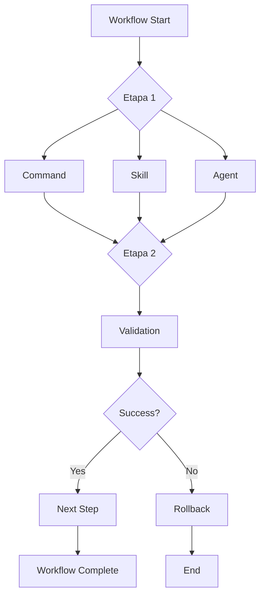

# Workflows - End-to-End Orchestrated Processes

Workflows são processos end-to-end que orquestram múltiplos comandos, skills e agents para completar tarefas complexas.

## 🔄 Workflows Disponíveis

### 1. full-feature-workflow
Cria uma feature completa do zero ao deploy.

**Uso:** `/workflow full-feature`

**Etapas:**
1. **Planning** - Define escopo e arquitetura
2. **Backend** - Cria use cases e testes
3. **Frontend** - Cria módulos e componentes
4. **Integration** - Conecta backend e frontend
5. **Testing** - Testes E2E
6. **Documentation** - Gera documentação
7. **Review** - Code review automático
8. **Commit** - Validações e commit

**Duração estimada:** 15-30 minutos

---

### 2. database-change-workflow
Gerencia mudanças no banco de dados de forma segura.

**Uso:** `/workflow database-change`

**Etapas:**
1. **Backup** - Cria backup do schema atual
2. **Schema Analysis** - Analisa impacto da mudança
3. **Migration** - Cria migration
4. **Validation** - Valida migration
5. **Testing** - Testa em ambiente de dev
6. **Documentation** - Documenta mudança
7. **Rollback Plan** - Cria plano de rollback

**Duração estimada:** 5-10 minutos

---

### 3. refactoring-workflow
Refatora código mantendo funcionalidade e testes.

**Uso:** `/workflow refactor`

**Etapas:**
1. **Analysis** - Analisa código atual
2. **Test Coverage** - Verifica cobertura de testes
3. **Refactoring** - Executa refatoração
4. **Test Validation** - Garante que testes passam
5. **Architecture Check** - Valida padrões
6. **Performance Check** - Verifica performance
7. **Documentation** - Atualiza docs

**Duração estimada:** 10-20 minutos

---

### 4. pr-preparation-workflow
Prepara um Pull Request completo.

**Uso:** `/workflow prepare-pr`

**Etapas:**
1. **Validation** - Roda validações (/pre-commit)
2. **Architecture Check** - Valida arquitetura
3. **Code Review** - Review automático
4. **Test Coverage** - Verifica cobertura
5. **Documentation** - Atualiza/gera docs
6. **Changelog** - Gera changelog
7. **PR Creation** - Cria PR com template

**Duração estimada:** 5-10 minutos

---

### 5. onboarding-workflow
Auxilia novos desenvolvedores a entender o projeto.

**Uso:** `/workflow onboard`

**Etapas:**
1. **Project Tour** - Overview da estrutura
2. **Architecture Explanation** - Explica padrões
3. **Setup Validation** - Verifica setup local
4. **Example Feature** - Cria feature de exemplo
5. **Documentation Links** - Fornece recursos
6. **First Task** - Sugere primeira tarefa

**Duração estimada:** 20-30 minutos

---

## 🎯 Como Usar Workflows

### Via Comando

```bash
/workflow full-feature

# Com argumentos
/workflow full-feature --name payments --type transaction
```

### Via Programático

```typescript
// Em um hook ou script
{
  "type": "workflow",
  "workflow": "full-feature-workflow",
  "params": {
    "featureName": "payments",
    "featureType": "transaction"
  }
}
```

---

## 🏗️ Anatomia de um Workflow

Um workflow típico consiste de:

```markdown
---
workflow: workflow-name
description: What this workflow accomplishes
duration: estimated time
complexity: low|medium|high
---

# Workflow: <Name>

## Objetivo
<End-to-end goal>

## Pré-requisitos
- Prerequisite 1
- Prerequisite 2

## Etapas

### 1. Etapa 1
**Objetivo:** <What this step does>
**Ferramentas:** [command1, skill1, agent1]
**Duração:** X minutos

### 2. Etapa 2
**Objetivo:** <What this step does>
**Ferramentas:** [command2, skill2]
**Duração:** X minutos

## Success Criteria
- Criteria 1
- Criteria 2

## Rollback
<How to rollback if something fails>

## Outputs
- Output 1
- Output 2
```

---

## 🔄 Workflow Orchestration

Workflows orquestram diferentes tipos de recursos:



---

## 📋 Workflow Configuration

Configure workflows em `.claude/settings.local.json`:

```json
{
  "workflows": {
    "full-feature-workflow": {
      "enabled": true,
      "autoValidation": true,
      "stopOnError": true,
      "config": {
        "createTests": true,
        "createDocs": true,
        "autoCommit": false
      }
    },
    "pr-preparation-workflow": {
      "enabled": true,
      "config": {
        "minCoverage": 80,
        "requireDocs": true,
        "autoCreatePR": false
      }
    }
  }
}
```

---

## 🎓 Best Practices

### 1. Make Workflows Idempotent
Workflows devem poder ser executados múltiplas vezes com segurança.

✅ **Bom:**
```markdown
1. Check if file exists
2. If not, create file
3. Update content
```

❌ **Ruim:**
```markdown
1. Create file (fails if exists)
2. Update content
```

### 2. Provide Clear Progress
Usuários devem saber o que está acontecendo.

```markdown
## Progress Reporting
[1/7] 🔍 Analyzing code...
[2/7] 🏗️ Creating backend structure...
[3/7] 🎨 Creating frontend components...
[4/7] 🧪 Running tests...
[5/7] 📝 Generating documentation...
[6/7] ✅ Validating architecture...
[7/7] 🎉 Workflow complete!
```

### 3. Handle Errors Gracefully
Cada etapa deve ter estratégia de error handling.

```markdown
### Error Handling

**Etapa 3 falhou:**
1. Rollback etapas 1 e 2
2. Log erro detalhado
3. Sugerir correção manual
4. Permitir retry
```

### 4. Validate Prerequisites
Sempre valide que pré-requisitos estão satisfeitos.

```markdown
## Pré-requisitos
- ✅ Backend está rodando
- ✅ Database está acessível
- ✅ Ambiente configurado
- ✅ Git working directory clean
```

---

## 🚀 Como Criar um Novo Workflow

### 1. Defina o Workflow

Crie `.claude/workflows/<workflow-name>.md`:

```markdown
---
workflow: my-workflow
description: Brief description
duration: X-Y minutes
complexity: medium
tags: [backend, frontend, testing]
---

# Workflow: My Workflow

## Objetivo
<Clear end-to-end goal>

## Pré-requisitos
- [ ] Prerequisite 1
- [ ] Prerequisite 2

## Etapas

### 1. [Nome da Etapa]
**Objetivo:** <What>
**Ferramentas:** [/command, skill, agent]
**Duração:** X min

```bash
# Commands to execute
/command arg1 arg2
```

**Validação:**
- [ ] Check 1
- [ ] Check 2

### 2. [Próxima Etapa]
...

## Success Criteria
- [ ] Final check 1
- [ ] Final check 2

## Outputs
- Output 1: <description>
- Output 2: <description>

## Troubleshooting

### Problema Comum 1
**Sintoma:** <What user sees>
**Causa:** <Why it happens>
**Solução:** <How to fix>

## Rollback Plan
1. Rollback step 3
2. Rollback step 2
3. Rollback step 1
```

### 2. Teste o Workflow

Execute manualmente cada etapa e ajuste conforme necessário.

### 3. Documente

Adicione à tabela de workflows neste README.

---

## 📊 Workflow Metrics

| Workflow | Etapas | Duração | Complexidade | Uso |
|----------|--------|---------|--------------|-----|
| full-feature-workflow | 8 | 15-30 min | Alta | Comum |
| database-change-workflow | 7 | 5-10 min | Média | Frequente |
| refactoring-workflow | 7 | 10-20 min | Alta | Ocasional |
| pr-preparation-workflow | 7 | 5-10 min | Média | Muito comum |
| onboarding-workflow | 6 | 20-30 min | Baixa | Raro |

---

## 🗺️ Roadmap

### Em Desenvolvimento
- [ ] `full-feature-workflow` - Feature completa
- [ ] `pr-preparation-workflow` - Preparar PR

### Planejados
- [ ] `deployment-workflow` - Deploy end-to-end
- [ ] `hotfix-workflow` - Hotfix rápido e seguro
- [ ] `dependency-update-workflow` - Atualizar dependências
- [ ] `performance-optimization-workflow` - Otimizar performance
- [ ] `security-audit-workflow` - Auditoria de segurança
- [ ] `api-versioning-workflow` - Versionar API
- [ ] `multi-environment-deploy-workflow` - Deploy em múltiplos ambientes

---

## 🔗 Integração com CI/CD

Workflows podem ser executados em pipelines:

```yaml
# .github/workflows/feature-complete.yml
name: Full Feature Workflow

on:
  workflow_dispatch:
    inputs:
      feature_name:
        description: 'Feature name'
        required: true

jobs:
  create-feature:
    runs-on: ubuntu-latest
    steps:
      - uses: actions/checkout@v2
      - name: Run Full Feature Workflow
        run: |
          claude-workflow run full-feature-workflow \
            --name ${{ github.event.inputs.feature_name }} \
            --auto-commit false
```

---

## 💡 Exemplos de Uso

### Exemplo 1: Criar Feature Completa

```bash
# Inicia workflow interativo
/workflow full-feature

# Workflow pergunta:
> Nome da feature: payments
> Tipo (crud/transaction/report): transaction
> Incluir testes E2E? (y/n): y

# Workflow executa:
[1/8] 🔍 Planning feature architecture...
[2/8] 🏗️ Creating backend use cases...
[3/8] 🎨 Creating frontend module...
[4/8] 🔌 Integrating backend and frontend...
[5/8] 🧪 Creating tests...
[6/8] 📝 Generating documentation...
[7/8] ✅ Running validations...
[8/8] 🎉 Feature complete!

# Output:
✅ Backend created in: backend/src/*/payments/
✅ Frontend created in: frontend/src/modules/payments/
✅ Tests created: 12 tests (100% coverage)
✅ Documentation updated
✅ Architecture validated
✅ Ready to commit!
```

### Exemplo 2: Preparar Pull Request

```bash
/workflow prepare-pr

# Workflow executa automaticamente:
[1/7] 🔍 Running validations...
  ✅ Lint passed
  ✅ Tests passed (coverage: 87%)
  ✅ Type check passed

[2/7] 🏗️ Validating architecture...
  ✅ Clean Architecture: OK
  ✅ Feature-Sliced Design: OK

[3/7] 👁️ Running code review...
  ℹ️ 3 suggestions found

[4/7] 📊 Checking test coverage...
  ✅ Coverage: 87% (threshold: 80%)

[5/7] 📝 Updating documentation...
  ✅ CHANGELOG updated
  ✅ API docs updated

[6/7] 📋 Generating PR description...
  ✅ PR description created

[7/7] 🎉 PR ready!

# Gera PR template:
## Summary
- Added payments feature
- Created 12 tests
- Updated documentation

## Changes
- Backend: 8 files
- Frontend: 9 files
- Tests: 12 files

## Test Plan
- [x] Unit tests passing
- [x] Integration tests passing
- [x] E2E tests passing

## Review Notes
- 3 suggestions from automated review (see comments)
```

---

## 📚 Recursos Adicionais

- [Commands README](../commands/README.md) - Comandos usados em workflows
- [Skills README](../skills/README.md) - Skills usados em workflows
- [Agents README](../agents/README.md) - Agents usados em workflows
- [Patterns](../patterns.md) - Templates de código

---

**Nota:** Workflows estão em desenvolvimento ativo. Contribuições são bem-vindas!
